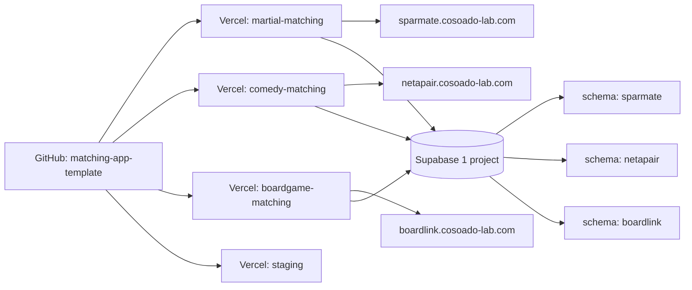

> Cosoado Lab Blog 同時掲載: https://cosoado-lab.com/blog/3-matching-apps-one-codebase/

「同じ構造のプロダクト、別ジャンルで横展開できないか」と考えたことがある個人開発者へ。

Next.js + Supabase の **1 コードベース**から、格闘技・お笑い・ボードゲーム向けの 3 つのマッチングアプリを並列で動かしています。"あと 1 人" を見つけたいユーザーを 3 コミュニティで同時に集めてみて、初めて見えた現実を書きます。

---

## 走らせている 3 アプリ

| アプリ | ドメイン | ジャンル |
|---|---|---|
| **SparMate** | sparmate.cosoado-lab.com | 格闘技の練習相手マッチング (BJJ / MMA / Boxing 等) |
| **NetaPair** | netapair.cosoado-lab.com | お笑いの相方探し (ボケ / ツッコミ / ネタ方向性) |
| **BoardLink** | boardlink.cosoado-lab.com | ボードゲーム・TRPG の卓メンバー募集 |

3 つとも、同じ 1 本の Next.js + Supabase のコードから動いている。

---

## はじめに — 首を痛めた火曜の夜から始まった

最初に作ったのは、格闘技の練習相手を探すアプリだった。

きっかけは単純で、ブラジリアン柔術のオープンマットで体重差 20kg の相手と 5 分やって首を痛めた、その火曜の夜。湿布の匂いの中で「今週も同じサイズの人いなかったな」と思い、**"体重・レベル・エリアで相手を探せたら解決するのでは？"** とメモに書き留めたのが出発点だった。

それが SparMate になった。

作ってから 2 週間後、友人のお笑い芸人に「相方探しで似た悩みを抱えている」と聞いた。「ボケとツッコミ、ネタの方向性、温度感で探せたら…」。聞きながら気づいた。**アプリの中身、ほとんど同じじゃないか？**

そこから派生したのが NetaPair（お笑いの相方探し）と BoardLink（ボードゲームの卓メンバー募集）。

---

## アプリが違っても、痒みの形は同じだった

3 ジャンルで当事者に話を聞いて驚いたのは、"あと 1 人" 問題の構造がほぼ同じだったこと。

| ジャンル | 悩み | 足りない "1 人" |
|---|---|---|
| 格闘技 | 体重・レベルが近い練習相手がジムにいない | 同じ階級の青帯 |
| お笑い | 笑いのツボと熱量が合う相方がいない | ネタ方向性の合う 1 人 |
| ボドゲ | 4 人必要なゲームに 3 人しか集まらない | あと 1 人 |

違うのは「条件の名前」と「言葉のトーン」だけ。

> マッチングの本質はアルゴリズムじゃない。"条件で絞れる" × "メッセージを送れる" が揃えば、あとはユーザーが勝手に見つける。

この発見が、全部を 1 コードベースでやる決め手になった。

---

## 1 つの env var で 3 アプリに分岐する

### コードのほぼ全部は共通。違うのは `genre.ts` だけ

```ts
// src/config/genre.ts（実値を抜粋）
export const GENRE_CONFIGS = {
  martial: {
    name: 'SparMate',
    primaryColor: '#dc2626',
    defaultLanguage: 'en',        // 海外 BJJ コミュニティが主戦場
    featureFlags: {
      locationRequired: true,      // ジムに通える距離じゃないと意味がない
      superLikeEnabled: false,     // 出会い系っぽくしない
      ageFilterEnabled: false,     // 年齢より体重・レベル
    },
  },
  comedy: {
    name: 'NetaPair',
    primaryColor: '#f97316',
    defaultLanguage: 'ja',
    featureFlags: {
      locationRequired: false,     // 脚本作業はリモート可
      superLikeEnabled: true,      // 相方探しは熱量勝負
      ageFilterEnabled: true,
    },
  },
  boardgame: {
    name: 'BoardLink',
    primaryColor: '#7c3aed',
    defaultLanguage: 'ja',
    featureFlags: {
      locationRequired: true,      // 対面プレイ前提
      superLikeEnabled: false,
      ageFilterEnabled: false,
    },
  },
}
```

これを `getGenreConfig()` で読むだけ。ジャンルごとに `NEXT_PUBLIC_GENRE` を切り替えてビルドすれば、同じコードから別々のアプリが出来上がる。

### デプロイは Vercel の 4 プロジェクト並列

全体構成を図示するとこうなる。



同じ GitHub リポジトリを 4 つの Vercel プロジェクトに紐づけている。

| プロジェクト | 環境変数 | ドメイン |
|---|---|---|
| martial-matching | `NEXT_PUBLIC_GENRE=martial` | sparmate.cosoado-lab.com |
| comedy-matching | `NEXT_PUBLIC_GENRE=comedy` | netapair.cosoado-lab.com |
| boardgame-matching | `NEXT_PUBLIC_GENRE=boardgame` | boardlink.cosoado-lab.com |
| matching-app-template | — | (staging) |

`git push` 1 回で 3 本番 + 1 staging が**並列ビルド**される。マイグレーションも 1 本書けば全アプリに適用される。

### DB は 1 Supabase プロジェクト × スキーマ分離

ジャンルごとに DB を分けるか迷ったけど、1 プロジェクトにまとめてスキーマ（`netapair` / `sparmate` / `boardlink`）で分離する方にした。

**理由は運用コスト。** マイグレーション 1 箇所、監視 1 箇所、課金 1 本。3 倍のダッシュボードを眺める個人開発者になりたくなかった。

スキーマ間は RLS（Row Level Security）で完全に遮断していて、片方のデータがもう片方に漏れない構造になっている。

---

## 3 つ同時に回して初めて見えたこと

ここからが、個人的には記事の本題。**1 つしか作ってなかったら絶対気づかなかったこと**が、並走してみて見えてきた。

### 気づき 1：マッチングアプリの 9 割は "検索 + DM" で足りる

作る前は「マッチング」の本質はレコメンドエンジンだと思っていた。違った。

ユーザーがやりたいのは「条件で絞る → 合いそうな人に話しかける」だけ。どのジャンルでも、満足度を決めるのは**条件の種類の豊富さ**と**メッセージの送りやすさ**で、アルゴリズムの賢さではなかった。

> レコメンドエンジンに工数を吸われる前に気づくべきだった。マッチングアプリの満足度を決めるのは「検索フィルターの数」と「DM の 1 クリック距離」で、機械学習はほぼ関係ない。

### 気づき 2：ジャンルによって "距離" の重みが丸ごと違う

これは完全に想定外だった。

- **格闘技**: ジムに通える距離じゃないと成立しない（最重要）
- **ボドゲ**: カフェ集合が基本（重要）
- **お笑い**: 脚本はリモートで書ける、合流はライブで（任意）

同じ "エリア検索" UI でも、デフォルトの扱いを `featureFlags.locationRequired` で出し分けている。お笑いだけはエリア必須を外した瞬間、体感で利用率が跳ねた。

### 気づき 3：「年齢フィルター」は出会い系のメンタルモデル

最初、全ジャンルに年齢フィルターを置いた。

格闘技ユーザーから真顔で言われた。**「年齢より体重・レベルで選びたい」**。

確かに、70kg の 45 歳と 30 歳、練習相手として適切かどうかは年齢では決まらない。出会い系の文脈で "当たり前" と思っていたフィルターが、別ジャンルでは機能どころかノイズだった。

SparMate だけ年齢フィルターを外した。

### 気づき 4：言語デフォルトの選択で体感で数倍変わる

SparMate を最初、日本語 UI で出した。BJJ の海外コミュニティは英語ネイティブなので、あまり刺さらなかった。英語に切り替えたら X 投稿の反応が体感で数倍に。

> 英語デフォルト UI にしただけで、BJJ 系 X 投稿のインプレッションが体感で 5 倍。`defaultLanguage` の 1 行の差が、そのまま市場規模の差になる。グローバル狙いのジャンルを日本語で出すのは、自ら市場を 1/20 に絞る行為。

### 気づき 5：「使ってる自分」が何より強いデータソース

NetaPair と BoardLink は、自分の痛みから生まれたアプリではない。僕はお笑いをやらないし、ボドゲもたまにしかやらない。

だから**機能の優先順位付けで迷う時間**が SparMate の 3 倍かかる。

SparMate は「柔術やってる自分がほしいか」で全部決められる。これが最速で作れた理由だし、**複数ジャンル展開を考えているなら、"scratch-your-own-itch" の 1 本を先に完成させてからテンプレ化する順番が圧倒的に速い**と言いたい。

---

## ユーザーから見ると、完全に別アプリ

3 アプリは、ユーザーにとって**完全に別プロダクト**として認知されている。

- SparMate は海外の BJJ コミュニティで紹介されている
- NetaPair は NSC 界隈で「相方募集」のハッシュタグと並んで流れる
- BoardLink はボドゲカフェでチラシが置かれる

それぞれ別コミュニティで独立して育っている。兄弟アプリだと気づく人はほぼいない（クロスプロモ投稿を見て初めて知る）。

これは意図的にやっている。**ブランディングは完全分離**。色、言語、ロゴ、コピー、プロフィールの項目まで最適化している。裏側が共通であることは、ユーザー体験の質には関係ない。

---

## 数字の話

ベータ期なので詳細数字は伏せるけれど、構造的な感覚だけ。

- **開発時間**: SparMate ≒ 2 週間（ほぼゼロから）、NetaPair と BoardLink 合わせて 3 日（テンプレ化後）
- **インフラ**: Vercel Hobby + Supabase Free で 3 アプリ運用中（トラフィック次第で有料）
- **発信運用**: X / Bluesky / Threads に 32 本の投稿を cron で 12 時間ごと自動配信
- **ユーザー層**: 3 ジャンル間でばらつきあり、初期は想定外の層が登録してくることが多い

個人開発で 1 アプリが回り始めるまで半年かかるのはよくある話。テンプレート化すると **3 アプリ分のフィードバックが並列で入る**ので、ジャンル比較の解像度が一気に上がる。これがいちばん効いたメリット。

> ※ テンプレ自体はマルチジャンル対応で、本稿で扱う 3 アプリの後に 4 本目として釣り仲間マッチング [TsuriMate](https://tsurimate.cosoado-lab.com) を β 稼働中。本記事は「最初に立ち上げた 3 つ」に焦点を絞っている。

---

## 補遺：3 つのアプリ、使ってみたい人へ

（ここから先は記事本論ではなく、興味があれば触ってもらえると嬉しいというお知らせ）

全部無料のベータ版。全部「あと 1 人」を見つけるためのアプリです。

- 🥊 [**SparMate**](https://sparmate.cosoado-lab.com) — 体重・レベル・エリアで格闘技の練習相手をマッチング
- 🎤 [**NetaPair**](https://netapair.cosoado-lab.com) — ボケ・ツッコミ・ネタ方向性でお笑いの相方探し
- 🎲 [**BoardLink**](https://boardlink.cosoado-lab.com) — タイトル・レベル感・エリアでボドゲ・TRPG 仲間募集

同じ "あと 1 人" の壁を感じている方は、ぜひログインだけでも試してみてください。登録は 60 秒、合わなければ即退会で OK です。**あなたのジャンルで登録者がまだ少なくても、"最初の 1 人" になる価値はあります**——その 1 人目がいれば、次の 1 人はもう探しに来るので。

---

## 最後に — "レバレッジ" の再定義

個人開発の最大の壁は「時間」。それを突破する方法として、コードを使い回すだけじゃなく**コミュニティごと使い回す**発想にたどり着いた。

1 つの退屈なスタック（Next.js + Supabase + Vercel）で、3 つの違うコミュニティに届ける。

もし自分が「趣味 X のマッチングアプリ、誰か作ってくれないかな」と思っていた側の人がこれを読んでいたら、**実は `genre.ts` に 1 エントリ足せば立ち上がる**ということを伝えたい。3 つ目までいけた実感として、4 つ目のジャンルを誰かと一緒に立ち上げるのも面白いと思っている。

興味があれば、各アプリの問い合わせ窓口から声をかけてもらえると嬉しいです。

---

:::message

公式ブログ版もあります → https://cosoado-lab.com/blog/3-matching-apps-one-codebase/

:::
